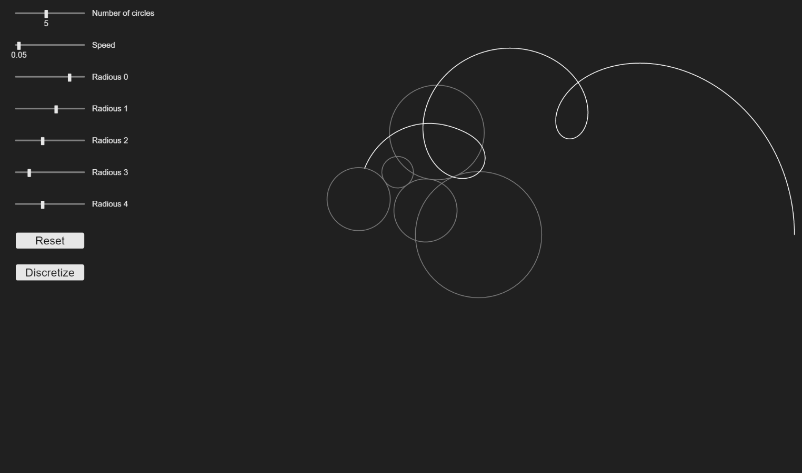
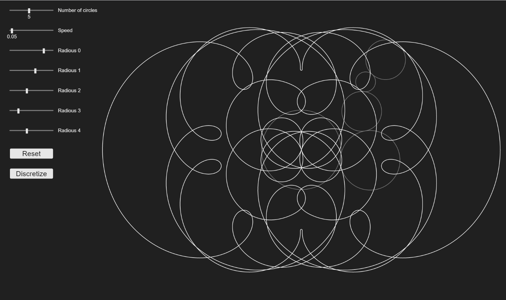
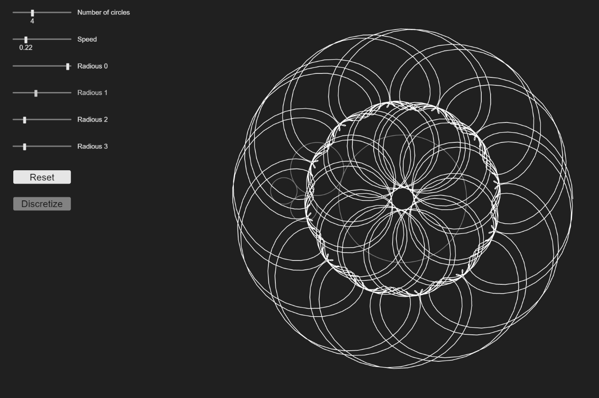

# js-rolling circles
This is a small proyect to draw diferent shapes made by rolling some over others, it's made using the awesome library <a href="https://p5js.org/">p5.js</a>.
## URL
This proyect is hosted by github pages, you can check it out at <a href="https://pabloqb2000.github.io/js-rolling_circles/">this link</a>.
## Available options
  - Number of circles rolling
  - Speed, to change the speed of the animation (wich might result in sharper edges)
  - Radious of each circle
  - Reset button to reset the drawing
  - Discretize button to make the radious increase by intervals
## Notes
#### Speed
Increasing the speed produces a faster animation but might result in a sharper shape  
Tune this parameter where edges don't look ugly but the animation is not super slow.
#### Discretizing
The discretize button resets the radious of the circles and makes them go in intervals.
## Screenshots
</img>
</img>
</img>
## References
To find more information about the <b>awesome</b> library used for this proyect visit:
<a href="https://p5js.org/"> https://p5js.org/ </a>

## Other proyects
Checkout my other proyects at <a href="https://pabloqb2000.github.io/Click_math/">Click math</a>